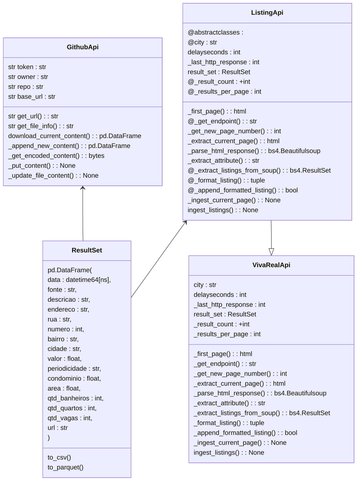

# Florianópolis Rent Price Monitoring

[](https://www.codefactor.io/repository/github/strangercacaus/florianopolis_rent_pricing_monitoring/overview/main)


### Objetivo:

O objetivo deste projeto é capturar recorrentemente dados dos preços de aluguéis ativos em Florianópolis-SC e disponibilizar para analists de dados e interessados da região.

### Inspiração:

A ideia inicial do projeto veio de um exercício de ingestão de dados do bootcamp de engenharia de dados da How Education em 2023 que consistia em realizar o crawling do site vivareal e recuperar informações referentes aos imóveis.

Ao longo do tempo percebi que não havia uma base de dados pública que tivesse dados históricos dos valores de imóveis anunciados nos portais e por este motivo o objetivo deste projeto é expandir o estudo inicial realizando esta captura de dados de modo recorrente e abertamente disponível.

### Escopo:

O projeto se baseia na realização de uma rotina semanal de web-scraping utilizando a plataforma Kaggle:

[](https://www.kaggle.com/code/caueausec/florian-polis-rent-pricing-dataset-web-scraping)

Os dados são coletados a partir do site Viva Real, estruturados no formato de um Dataframe Pandas e então
adicionados ao arquivo Dataset.csv aqui no github.

### Estrutura de classes


Uma vez gravados, os dados são disponibilizados no Kaggle em um Dataset Público:

[](https://www.kaggle.com/datasets/caueausec/florianpolis-rent-pricing-dataset)

Além do Dataset Público, há um notebook Kaggle com exemplos de análises de dados:

[](https://www.kaggle.com/code/caueausec/florianopolis-rent-pricing-dataset-eda)

### Estrutura do Projeto:
```
- code/ # Pasta com os arquivos de código do projeto
    - florianópolis_rent_prince_web_scraping.ipynb --> Notebook de extração de dados
    - Florianopolis_rent_pricing_dataset_eda.ipynb --> Notebook com exemplo de análise

- data/ # Pasta com os arquivos de dados (output
    - dataset.csv # Dataset completo do projeto

- docs/ # Pasta de documentações

- maps/ # Pasta para arquivos de mapa do projeto.
``````
### Tags de tecnologias utilizadas:


